<div align="center">




</div>

---

### 🕯️ about

```
~/  ตี 2 · กาแฟแก้วที่สาม · แมวนอนทับ trackpad

  🍎  เขียนแอปบน Apple platform เป็นหลัก
  🧶  ชอบงานที่โค้ดชุดเดียวรันได้หลายจอ
  🌱  Swift Concurrency, SwiftUI ที่ไม่กระพริบ
  🐈‍⬛  แมวดำหนึ่งตัว เป็น code reviewer ที่เข้มงวดที่สุด
```

<div align="center">


</div>

---

<div align="center">




</div>

<details>
<summary><b>🐾 รอยเท้าแมว — contribution graph</b></summary>

<br>


</details>

<div align="center">
<br>
<sub>🕯️ <i>"โค้ดที่ดีที่สุดคือโค้ดที่ไม่ต้องเขียน" — แมวเห็นด้วย</i></sub>
</div>


